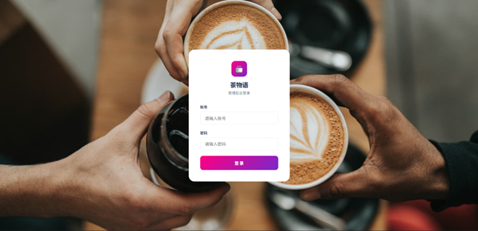
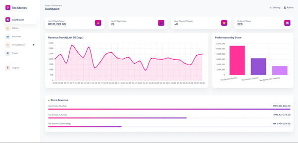
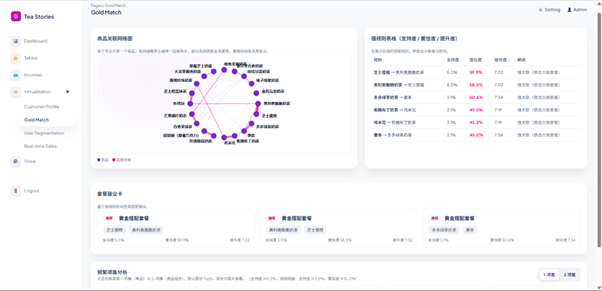
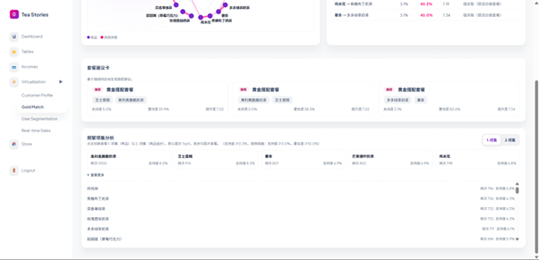
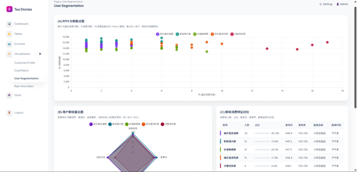
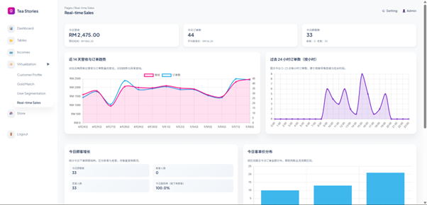
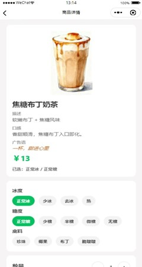
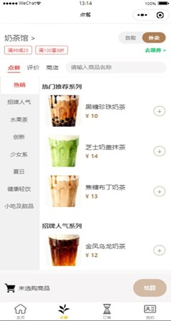
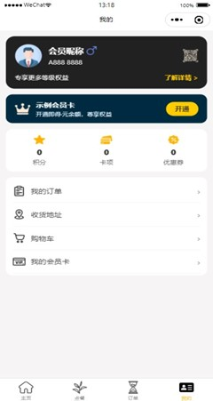
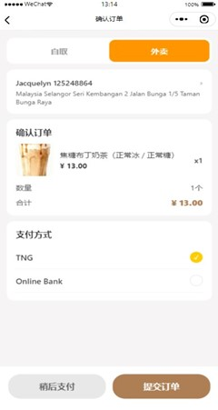

# Apriori Algorithm Recommendation System

This repository is a full-stack beverage ordering and recommendation project built for portfolio and interview demonstration.  
It integrates a Flask admin backend, recommendation logic (Apriori + clustering), a WeChat Mini Program client, and a React Native mobile client.

## Academic Context

This project was developed during my study period in China.  
For that reason, most in-system labels, comments, and business-facing texts are primarily in Chinese.

## Language Note for Reviewers

- Primary language inside the system: Chinese
- Primary language in this README (first section): English
- Chinese explanation is provided in a dedicated section after the full English documentation

If you are an English-speaking reviewer, please use the screenshots and section-by-section explanations below to understand each page's purpose and workflow.

## Project Structure

- `backend`: Flask backend, admin pages, analytics pages, and miniapp APIs
- `weapp`: WeChat Mini Program frontend
- `mobile`: React Native (Expo) frontend
- `sql`: Database schema/setup scripts
- `img`: UI screenshots for backend and miniapp

## Core Capabilities

1. **Customer Profiling and Segmentation**
   - Build user profile statistics (gender, age, occupation, city, growth).
   - Perform clustering-based segmentation for customer groups.

2. **Apriori-Based Product Recommendation**
   - Mine item associations from order data.
   - Generate recommendation rules with support/confidence/lift levels.
   - Provide practical recommendation use cases such as bundle design and smart suggestion.

3. **Business Dashboard and Realtime Monitoring**
   - Sales dashboard for trend and store-level visibility.
   - Realtime metrics such as hourly orders, ticket-size distribution, and category share.

4. **End-to-End Ordering Flow**
   - Miniapp and mobile ordering workflows.
   - Order persistence, history querying, and status transitions.

## Tech Stack

- Backend: Flask, PyMySQL, NumPy, scikit-learn
- Frontend: WeChat Mini Program, React Native (Expo)
- Database: MySQL

## Demo Environment Notice

- The public demo can run in a low-cost/free deployment mode using SQLite (`backend/data/tea_shop.db`) instead of managed MySQL.
- Demo records are generated by seed scripts for feature walkthroughs and UI behavior checks; they are not production business data.
- In production, please use managed MySQL with backups, migration control, and unified timezone settings.
- Link: https://jacquelyn.pythonanywhere.com/ (username & pwd: admin)

## Quick Start

### 1) Run Backend

```bash
cd backend
pip install -r requirements.txt
python app.py
```

Access URLs:

- Admin panel: `http://localhost:5000/admin`
- API base: `http://localhost:5000/api/...`

### 2) Run Mobile (Expo)

```bash
cd mobile
npm install
npm run start
```

### 3) Run WeChat Mini Program

Import the `weapp` directory into WeChat DevTools and configure its API base URL to point to your backend server.

## Screenshot Walkthrough

### A) Flask Backend

#### 1. Login Page

- Purpose: entry point for admin users.
- What to look at: credential validation and protected-route access.

#### 2. Dashboard

- Purpose: high-level business overview.
- What to look at: revenue, orders, customer trend, and store performance.

#### 3. Gold Match (Recommendation) - View 1

- Purpose: visualize Apriori rule outcomes.
- What to look at: frequent pairs, top rules, and recommendation confidence.

#### 4. Gold Match (Recommendation) - View 2

- Purpose: additional recommendation details and strategy cards.
- What to look at: actionable bundle suggestions and rule ranking.

#### 5. User Segmentation

- Purpose: analyze customer segments and behavior profiles.
- What to look at: segment distribution, group characteristics, and migration signals.

#### 6. Realtime Sales

- Purpose: monitor current-day sales operations.
- What to look at: hourly trend, order volume, and live business indicators.

### B) WeChat Mini Program

#### 1. Main Page

- Purpose: home entry and navigation.
- What to look at: user-facing entry points to products and order flow.

#### 2. Product Page

- Purpose: product browsing and selection.
- What to look at: item listings and purchasable menu structure.

#### 3. Order Page

- Purpose: checkout and order creation.
- What to look at: order details, total calculation, and submit flow.

#### 4. Profile Page

- Purpose: user account and personal operations.
- What to look at: user info, entry to historical orders and account actions.

#### 5. History Page

- Purpose: persistent order history for user review.
- What to look at: previous orders and status trace.

#### 6. Confirm Order

- Purpose: order completion interaction.
- What to look at: status transition from pending/picked to completed.

### C) More Images

- Backend screenshots directory: `img/Flask/`
- Miniapp screenshots directory: `img/Miniapp/`

## Portfolio Highlights

- Demonstrates full-stack delivery: algorithms + backend + frontend integration
- Translates data-mining outputs into business-friendly pages and decisions
- Includes practical workflows rather than isolated technical demos
- Structured for interview walkthrough with clear modules and reproducible setup

## Notes

- This repository is curated for portfolio review.
- Certain labels and interface texts remain Chinese by design (real project context).
- Temporary local files and personal configurations are excluded from version control.

---

# 中文说明

## 项目背景

本项目是在我于中国留学期间完成的，因此系统中的业务字段、页面文案和注释多数以中文为主，这也是项目真实使用场景的一部分。

## 项目简介

这是一个用于作品集与面试展示的全栈饮品点餐与推荐系统，整合了 Flask 后端管理系统、Apriori 关联推荐、用户分群分析、微信小程序和移动端流程。  
项目不仅关注算法结果，也强调业务可用性与页面可解释性。

## 项目结构

- `backend`: Flask 后端、管理后台页面、分析页面、小程序 API
- `weapp`: 微信小程序前端
- `mobile`: React Native（Expo）前端
- `sql`: 数据库建表与初始化脚本
- `img`: 后端与小程序页面截图

## 核心能力

### 1）用户画像与分群
- 提供用户画像统计（性别、年龄、职业、城市、增长趋势）
- 使用聚类方法做用户分群，输出群体特征与迁移信息
- 支持运营视角理解“高价值用户/潜力用户/流失用户”差异

### 2）Apriori 关联推荐
- 基于订单数据挖掘商品共现关系
- 使用支持度、置信度、提升度评估规则质量
- 输出可直接用于“套餐设计、智能推荐、陈列优化”的规则结果

### 3）经营看板与实时监控
- 管理后台展示门店经营数据与趋势
- 实时销售页提供小时订单趋势、客单价分布、类目占比
- 支持从总览到明细的分析路径

### 4）完整下单链路
- 覆盖小程序/移动端从浏览商品到下单完成的流程
- 支持历史订单查询与订单状态流转
- 后端 API 与业务页联动，形成完整闭环

## 快速启动

### 1）启动后端

```bash
cd backend
pip install -r requirements.txt
python app.py
```

访问地址：

- 管理后台：`http://localhost:5000/admin`
- API 基础路径：`http://localhost:5000/api/...`

### 2）启动移动端（Expo）

```bash
cd mobile
npm install
npm run start
```

### 3）启动微信小程序

将 `weapp` 目录导入微信开发者工具，并将其 API 地址配置到后端服务。

## 演示环境说明

- 公开演示可在低成本/免费环境下使用 SQLite（`backend/data/tea_shop.db`）运行，而不是托管 MySQL。
- 演示数据由 seed 脚本生成，主要用于功能流程与页面展示，不代表真实生产经营数据。
- 生产部署建议使用托管 MySQL，并配置备份、迁移流程与统一时区策略。
- 链接：https://jacquelyn.pythonanywhere.com/ (用户名 & 密码： admin)

## 页面截图讲解（中文）

### A）Flask 后端页面

#### 1. 登录页

- 页面用途：后台管理员入口
- 重点说明：用于受保护页面访问控制与登录态验证

#### 2. Dashboard 数据看板

- 页面用途：展示整体经营总览
- 重点说明：可快速查看营收、订单、顾客趋势与门店表现

#### 3. 黄金搭配推荐页（视图一）

- 页面用途：展示 Apriori 关联推荐主结果
- 重点说明：用于查看高频组合与高价值规则

#### 4. 黄金搭配推荐页（视图二）

- 页面用途：补充推荐规则细节与策略卡片
- 重点说明：可用于套餐设计与营销动作参考

#### 5. 用户分群页

- 页面用途：展示分群结果与群体画像
- 重点说明：帮助识别高价值群体与潜在流失群体

#### 6. 实时销售页

- 页面用途：当天经营实时监控
- 重点说明：可观察小时级订单变化与实时指标

### B）微信小程序页面

#### 1. 首页

- 页面用途：用户进入小程序后的主入口
- 重点说明：承接商品、下单与个人中心入口

#### 2. 商品页

- 页面用途：浏览与选择商品
- 重点说明：展示商品结构、价格与可购买信息

#### 3. 下单页

- 页面用途：确认订单并提交
- 重点说明：体现订单金额计算与提交流程

#### 4. 个人中心

- 页面用途：个人信息与功能入口聚合
- 重点说明：可进入历史订单和账户相关功能

#### 5. 历史订单页

- 页面用途：查看历史订单记录
- 重点说明：支持订单追溯与状态查看

#### 6. 取餐确认页

- 页面用途：订单完成确认
- 重点说明：展示订单状态从待处理到完成的流转

### C）更多截图

- 后端截图目录：`img/Flask/`
- 小程序截图目录：`img/Miniapp/`

## 作品集亮点

- 兼顾算法能力与业务落地，不只是模型演示
- 前后端联动完整，具备可演示的真实系统流程
- 页面与数据逻辑可解释，方便面试场景讲解
- 已整理为英文优先 + 中文完整说明，便于不同语言审阅者理解
